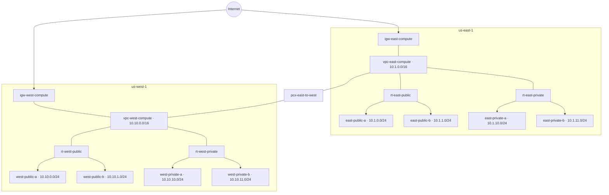

## AWS infra setup

> **NOTE:**
> - This document describes the bootstrap of a sample AWS infrastructure using Terraform.
> - Requires Terraform ≥1.10 and AWS provider ≥6.34.0.
> - AWS authentication relies on the `AWS_PROFILE` environment variable — ensure it is set before running any Terraform commands, e.g. `export AWS_PROFILE=<your-profile>`.

## Table of Contents

- [Remote State](#remote-state)
- [New Module Bootstrap](#new-module-bootstrap)
- [01-bootstrap](#01-bootstrap)
- [02-networking](#02-networking)
  - [core-vpcs](#core-vpcs)
  - [core-subnets](#core-subnets)
  - [core-routing](#core-routing)
- [Resources Diagram](#resources-diagram)

## Remote State

All modules store state in S3 bucket `terraform-state-607527010331`. It is created in `01-bootstrap` step, using local state.

| Module                      | State key                                                 |
|-----------------------------|-----------------------------------------------------------|
| 02-networking/core-vpcs     | `aws-infra/02-networking/core-vpcs/terraform.tfstate`     |
| 02-networking/core-subnets  | `aws-infra/02-networking/core-subnets/terraform.tfstate`  |
| 02-networking/core-routing  | `aws-infra/02-networking/core-routing/terraform.tfstate`  |
| 03-vault                    | `aws-infra/03-vault/terraform.tfstate`                    |

## New Module Bootstrap

Copy files from `module_skel/` into the new module directory and replace the `<module-path>` placeholders in `locals.tf` and `terraform.tf` with the module's relative path (e.g. `02-networking/core-vpcs`).

## 01-bootstrap

Native S3 state locking via `use_lockfile = true` — no DynamoDB table required.

**Resources:**
- `aws_s3_bucket` — state bucket
- `aws_s3_bucket_versioning` — versioning enabled
- `aws_s3_bucket_server_side_encryption_configuration` — AES256 encryption
- `aws_s3_bucket_public_access_block` — all public access blocked

**Outputs:**
- `state_bucket_name` — bucket name
- `state_bucket_arn` — bucket ARN

## 02-networking

Creates resources in east and west regions for core networking infrastructure.

### core-vpcs

**Resources:**
- `aws_vpc.east` — east VPC (`us-east-1`) with DNS support enabled
- `aws_vpc.west` — west VPC (`us-west-1`) with DNS support enabled

**Outputs:**
- `east_vpc_id`, `west_vpc_id` — VPC IDs
- `east_vpc_cidr`, `west_vpc_cidr` — VPC CIDR blocks

### core-subnets

VPC CIDRs are retrieved from `core-vpcs` remote state. Subnet CIDRs are derived dynamically from those using `cidrsubnet()` — see [docs](https://developer.hashicorp.com/terraform/language/functions/cidrsubnet). AZs are resolved at runtime using `aws_availability_zones` filtered by `zone-type = availability-zone` to exclude Local Zones and Wavelength Zones.

**Resources:**
- `aws_subnet.east_private_a`, `aws_subnet.east_private_b` — east private subnets
- `aws_subnet.east_public_a`, `aws_subnet.east_public_b` — east public subnets
- `aws_subnet.west_private_a`, `aws_subnet.west_private_b` — west private subnets
- `aws_subnet.west_public_a`, `aws_subnet.west_public_b` — west public subnets

**Outputs:**
- `east_private_subnets`, `east_public_subnets` — east subnet maps (id, cidr, az, vpc_id per subnet)
- `west_private_subnets`, `west_public_subnets` — west subnet maps (id, cidr, az, vpc_id per subnet)

### core-routing

VPC peering between east (`us-east-1`) and west (`us-west-1`) regions. Routes added to all public and private route tables. Private subnets have local routing only (no NAT).

**Resources:**
- `aws_internet_gateway.east`, `aws_internet_gateway.west` — internet gateways attached to each VPC
- `aws_route_table.east_public`, `aws_route_table.east_private` — east route tables with subnet associations
- `aws_route_table.west_public`, `aws_route_table.west_private` — west route tables with subnet associations
- `aws_vpc_peering_connection.east_to_west` — cross-region VPC peering connection

**Outputs:**
- `east_igw_id`, `west_igw_id` — internet gateway IDs
- `east_public_route_table_id`, `east_private_route_table_id` — east route table IDs
- `west_public_route_table_id`, `west_private_route_table_id` — west route table IDs
- `vpc_peering_connection_id` — VPC peering connection ID

## Resources Diagram

