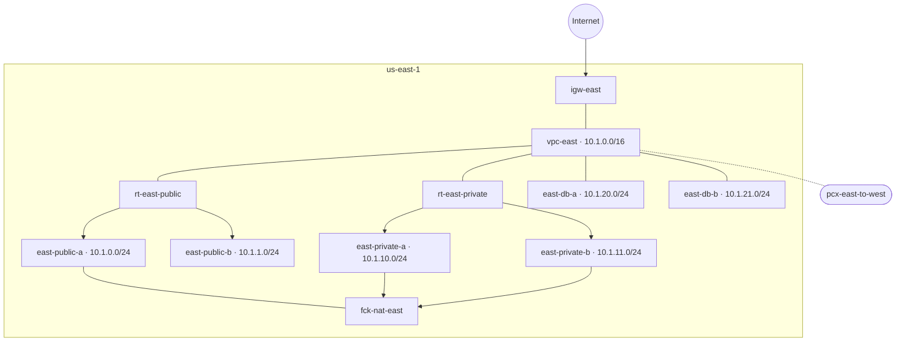
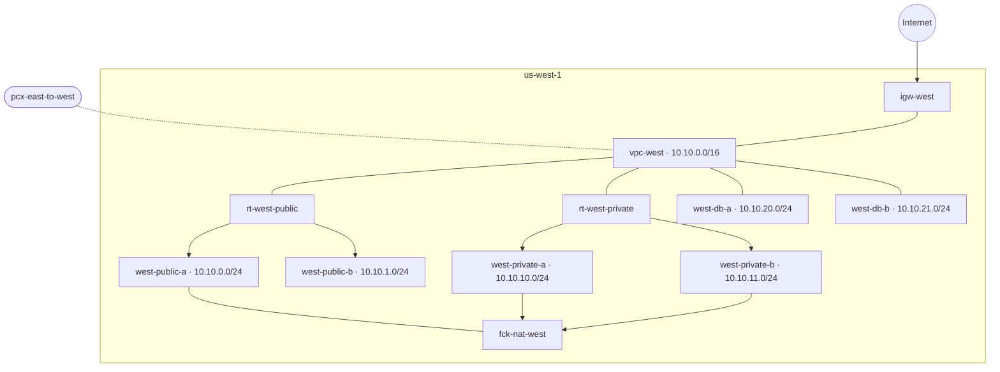
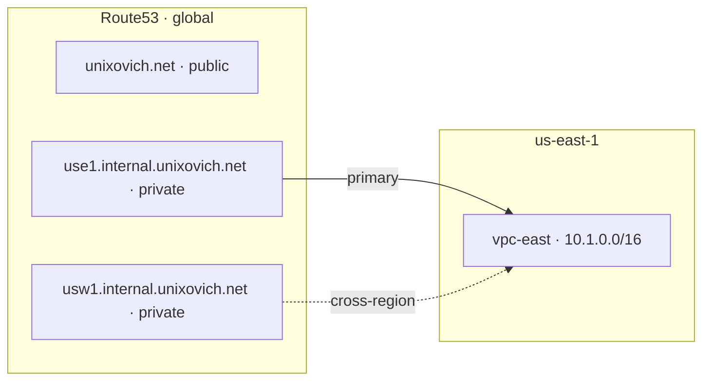
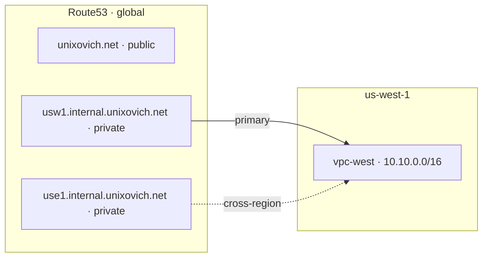
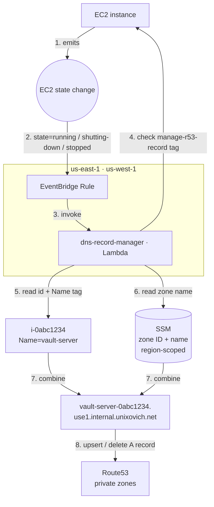
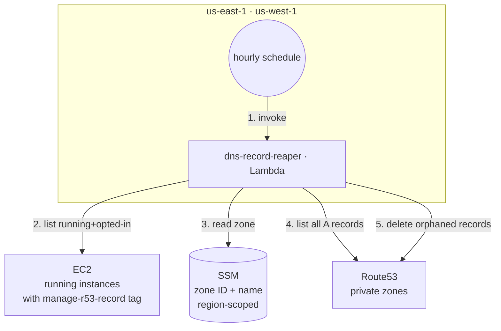
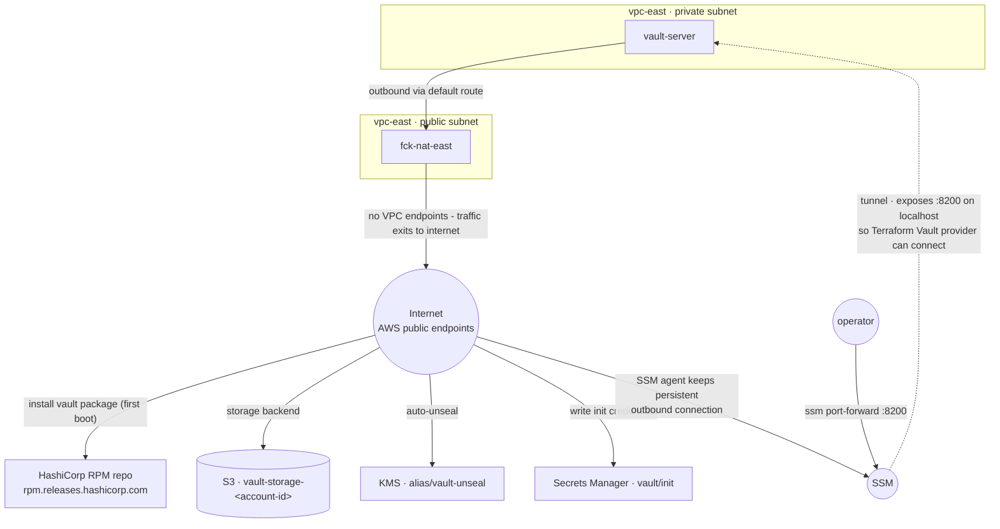
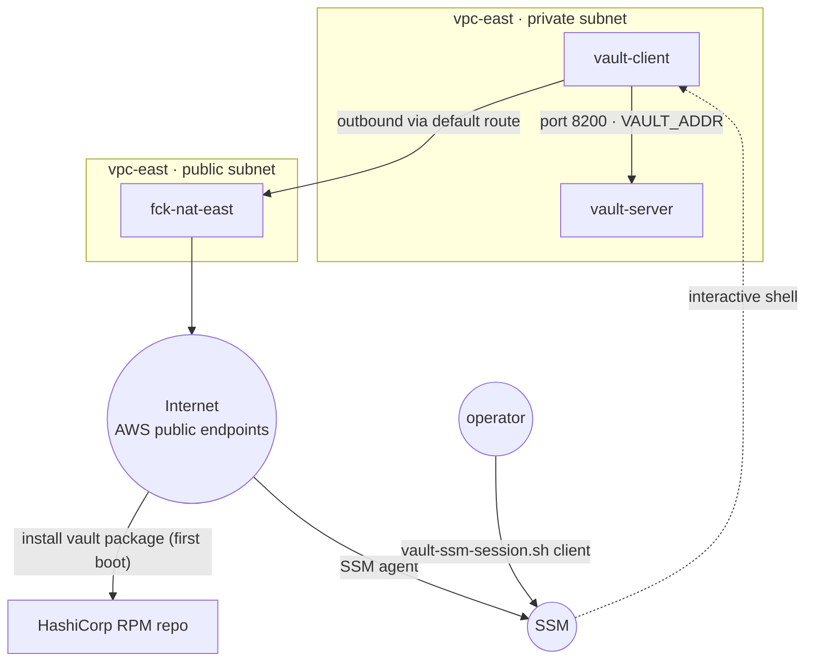

> **WARNING:** This repository is provided for educational purposes only. The author is not liable for any damage, data loss, or costs incurred as a result of using this code. Use at your own risk.

## AWS infra setup

> **NOTE:**
> - This document describes the bootstrap of a sample AWS infrastructure using Terraform.
> - Requires Terraform ≥1.10 and AWS provider ≥6.34.0.
> - AWS authentication relies on the `AWS_PROFILE` environment variable — ensure it is set before running any Terraform commands, e.g. `export AWS_PROFILE=<your-profile>`.

## Table of Contents

- [Setup](#setup)
- [Scripts](#scripts)
- [Provider](#provider)
- [Remote State](#remote-state)
- [Modules](#modules)
  - [01-bootstrap](#01-bootstrap)
  - [02-networking](#02-networking)
    - [core-vpcs](#core-vpcs)
    - [core-subnets](#core-subnets)
    - [core-routing](#core-routing)
    - [core-security-groups](#core-security-groups)
    - [core-nat](#core-nat)
    - [core-dns](#core-dns)
  - [03-iam](#03-iam)
    - [bastion](#bastion)
  - [04-vault](#04-vault)
    - [server](#server)
    - [bootstrap](#bootstrap)
    - [client](#client)
  - [05-dns-automation](#05-dns-automation)
    - [record-manager](#record-manager)
    - [record-reaper](#record-reaper)
- [New Module Bootstrap](#new-module-bootstrap)
- [Diagrams](#diagrams)
  - [Network Resources Diagram](#network-resources-diagram)
  - [Hosted Zones Diagram](#hosted-zones-diagram)
  - [DNS Automation Diagram](#dns-automation-diagram)
  - [DNS Reaper Diagram](#dns-reaper-diagram)
  - [Vault Resources Diagram](#vault-resources-diagram)
  - [Vault Client Diagram](#vault-client-diagram)

---

## Setup

Set AWS credentials before applying any module:
```bash
export AWS_PROFILE=<your-profile>
```
The profile must have broad permissions to create and delete VPCs, subnets, EC2 instances, IAM roles, and S3 buckets; admin-level access is recommended.

**How modules depend on each other:**

Each module is independently deployable — there is no Terraform nesting or module calls between them. Instead, downstream modules declare `data "terraform_remote_state"` blocks in `main.tf` to read outputs written by upstream modules to the shared S3 state backend. If an upstream module has not been applied yet, the plan fails immediately with a remote state read error. This makes dependencies explicit and enforces the apply order at plan time rather than silently producing incomplete infrastructure.

For consumers outside the Terraform ecosystem — scripts, CI pipelines, application config — key outputs are also published to SSM Parameter Store. This avoids coupling non-Terraform tooling to the S3 state backend. See the [Remote State](#remote-state) section for SSM path conventions.

**Apply order and dependencies:**

`01-bootstrap` must be applied before any other module — it creates the S3 bucket used as the Terraform state backend by every other module.

| # | Module | Depends on |
|---|--------|-----------|
| 1 | `02-networking/core-vpcs` | — |
| 2 | `02-networking/core-subnets` | `core-vpcs` |
| 3 | `02-networking/core-routing` | `core-vpcs`, `core-subnets` |
| 4 | `03-iam/bastion` | — |
| 5 | `02-networking/core-security-groups` | `core-vpcs` |
| 6 | `02-networking/core-nat` *(optional)* | `core-vpcs`, `core-subnets`, `core-routing`, `03-iam/bastion` |
| 7 | `02-networking/core-dns` | `core-vpcs` |
| 8 | `05-dns-automation/record-manager` | `core-dns` |
| 9 | `05-dns-automation/record-reaper` | `core-dns` |
| 10 | `04-vault/server` | `core-vpcs`, `core-subnets`; `core-nat` must be running |
| 11 | `04-vault/bootstrap` | `04-vault/server` applied and initialized; use `make vault-bootstrap` |
| 12 | `04-vault/client` | `core-vpcs`, `core-subnets`, `03-iam/bastion`, `04-vault/server`; `core-nat` must be running |

`core-nat` is optional — only needed when workloads in private subnets require internet access. `04-vault/server` always requires `core-nat` to be running (Vault needs it to reach KMS and S3 on startup).

**Applying modules:**

For each module: `cd <module-dir> && terraform init -backend-config=../../backend.hcl && terraform apply`

The shared S3 backend configuration (`bucket`, `region`, `encrypt`, `use_lockfile`) lives in `aws-infra/backend.hcl`. Each module's `terraform.tf` only contains the unique state `key`. The `-backend-config` flag merges the two at init time — omitting it causes Terraform to prompt for the missing backend attributes interactively.

A `Makefile` at the root of `aws-infra/` provides shorthand targets for each module and passes `-backend-config` automatically. The `vault-bootstrap` target also handles the SSM tunnel automatically.

- `make vault-server` — apply
- `make vault-server PLAN=1` — plan
- `make vault-server DESTROY=1` — destroy

---

## Scripts

Three scripts in `scripts/` handle SSM-based access patterns used by Makefile targets and direct CLI use:

- [scripts/vault-tunnel.sh](scripts/vault-tunnel.sh) `<region> <command>` — opens an SSM port-forwarding tunnel from `localhost:8200` to the Vault instance, waits for the Vault API to respond, runs the given command, then tears the tunnel down. Used by `make vault-bootstrap` and `make vault-status`.
- [scripts/ssm-run.sh](scripts/ssm-run.sh) `<region> <ssm-param-path> <command> [command...]` — looks up an instance ID from SSM Parameter Store, runs one or more shell commands on that instance via SSM Send-Command, polls until complete, and prints stdout. Used by `make core-nat-status`.
- [scripts/vault-ssm-session.sh](scripts/vault-ssm-session.sh) `server|client [region]` — opens an interactive SSM shell session on the Vault server or client instance, with an instance state check before attempting to connect.

---

## Provider

All modules use the [AWS Terraform provider](https://registry.terraform.io/providers/hashicorp/aws/latest) (`hashicorp/aws`). The provider translates Terraform resource definitions into AWS API calls, managing the full lifecycle of AWS resources (create, read, update, delete).

- [Registry page](https://registry.terraform.io/providers/hashicorp/aws/latest)
- [Documentation](https://registry.terraform.io/providers/hashicorp/aws/latest/docs)
- [GitHub](https://github.com/hashicorp/terraform-provider-aws)

All modules declare two aliased providers — `aws.east` (`var.east_region`, default `us-east-1`) and `aws.west` (`var.west_region`, default `us-west-1`). Every `resource` and `data` block explicitly sets `provider = aws.east` or `provider = aws.west`; there is no default (unaliased) provider. Both providers are declared even if a given module only deploys resources in one region — this keeps provider configuration uniform across all modules.

The canonical provider configuration lives in `shared/providers.tf`. Each module's `providers.tf` is a symlink pointing there — editing `shared/providers.tf` updates all modules at once. The one exception is `04-vault/bootstrap`, which keeps its own `providers.tf` because it also configures the Vault provider.

---

## Remote State

All modules store state in S3 bucket `terraform-state-607527010331`. It is created in `01-bootstrap` step, using local state.

| Module                              | State key                                                         |
|-------------------------------------|-------------------------------------------------------------------|
| [02-networking/core-vpcs](02-networking/core-vpcs) | `aws-infra/02-networking/core-vpcs/terraform.tfstate` |
| [02-networking/core-subnets](02-networking/core-subnets) | `aws-infra/02-networking/core-subnets/terraform.tfstate` |
| [02-networking/core-routing](02-networking/core-routing) | `aws-infra/02-networking/core-routing/terraform.tfstate` |
| [02-networking/core-security-groups](02-networking/core-security-groups) | `aws-infra/02-networking/core-security-groups/terraform.tfstate` |
| [02-networking/core-nat](02-networking/core-nat) | `aws-infra/02-networking/core-nat/terraform.tfstate` |
| [02-networking/core-dns](02-networking/core-dns) | `aws-infra/02-networking/core-dns/terraform.tfstate` |
| [03-iam/bastion](03-iam/bastion) | `aws-infra/03-iam/bastion/terraform.tfstate` |
| [04-vault/server](04-vault/server) | `aws-infra/04-vault/server/terraform.tfstate` |
| [04-vault/client](04-vault/client) | `aws-infra/04-vault/client/terraform.tfstate` |
| [04-vault/bootstrap](04-vault/bootstrap) | `aws-infra/04-vault/bootstrap/terraform.tfstate` |
| [05-dns-automation/record-manager](05-dns-automation/record-manager) | `aws-infra/05-dns-automation/record-manager/terraform.tfstate` |
| [05-dns-automation/record-reaper](05-dns-automation/record-reaper) | `aws-infra/05-dns-automation/record-reaper/terraform.tfstate` |

---

## Modules

### 01-bootstrap

Native S3 state locking via `use_lockfile = true` — no DynamoDB table required.

After applying this module, update `aws-infra/backend.hcl` with the bucket name before running `terraform init` on any other module:

```bash
terraform output -raw state_bucket_name
```

**Resource types:** [aws_s3_bucket](https://registry.terraform.io/providers/hashicorp/aws/latest/docs/resources/s3_bucket), [aws_s3_bucket_versioning](https://registry.terraform.io/providers/hashicorp/aws/latest/docs/resources/s3_bucket_versioning), [aws_s3_bucket_server_side_encryption_configuration](https://registry.terraform.io/providers/hashicorp/aws/latest/docs/resources/s3_bucket_server_side_encryption_configuration), [aws_s3_bucket_public_access_block](https://registry.terraform.io/providers/hashicorp/aws/latest/docs/resources/s3_bucket_public_access_block)

**Resources:**
- `aws_s3_bucket` — state bucket
- `aws_s3_bucket_versioning` — versioning enabled
- `aws_s3_bucket_server_side_encryption_configuration` — AES256 encryption
- `aws_s3_bucket_public_access_block` — all public access blocked

**Outputs:**
- `state_bucket_name` — bucket name
- `state_bucket_arn` — bucket ARN

---

### 02-networking

Creates resources in east and west regions for core networking infrastructure. See [Network Resources Diagram](#network-resources-diagram).

---

### core-vpcs

**Resource types:** [aws_vpc](https://registry.terraform.io/providers/hashicorp/aws/latest/docs/resources/vpc)

**Resources:**
- `aws_vpc.east` — east VPC (`us-east-1`) with DNS support enabled
- `aws_vpc.west` — west VPC (`us-west-1`) with DNS support enabled

**Outputs:**
- `east_vpc_id`, `west_vpc_id` — VPC IDs
- `east_vpc_cidr`, `west_vpc_cidr` — VPC CIDR blocks

---

### core-subnets

VPC CIDRs are retrieved from `core-vpcs` remote state. Subnet CIDRs are derived dynamically from those using `cidrsubnet()` — see [docs](https://developer.hashicorp.com/terraform/language/functions/cidrsubnet). AZs are resolved at runtime using `aws_availability_zones` filtered by `zone-type = availability-zone` to exclude Local Zones and Wavelength Zones.

**Resource types:** [aws_subnet](https://registry.terraform.io/providers/hashicorp/aws/latest/docs/resources/subnet)

**Resources:**
- `aws_subnet.east_private_a`, `aws_subnet.east_private_b` — east private subnets
- `aws_subnet.east_public_a`, `aws_subnet.east_public_b` — east public subnets
- `aws_subnet.east_db_a`, `aws_subnet.east_db_b` — east database subnets
- `aws_subnet.west_private_a`, `aws_subnet.west_private_b` — west private subnets
- `aws_subnet.west_public_a`, `aws_subnet.west_public_b` — west public subnets
- `aws_subnet.west_db_a`, `aws_subnet.west_db_b` — west database subnets

**Outputs:**
- `east_private_subnets`, `east_public_subnets`, `east_db_subnets` — east subnet maps (id, cidr, az, vpc_id per subnet)
- `west_private_subnets`, `west_public_subnets`, `west_db_subnets` — west subnet maps (id, cidr, az, vpc_id per subnet)

---

### core-routing

VPC peering between east (`us-east-1`) and west (`us-west-1`) regions. Private subnets route internet-bound traffic through fck-nat instances (added by `core-nat`). DB subnets are fully isolated — local routing only, no IGW or peering routes.

Route tables are defined in `route_tables.tf`. Routes are added separately as `aws_route` resources in `igw.tf` and `vpc_peering.tf`.

**Resource types:** [aws_internet_gateway](https://registry.terraform.io/providers/hashicorp/aws/latest/docs/resources/internet_gateway), [aws_route_table](https://registry.terraform.io/providers/hashicorp/aws/latest/docs/resources/route_table), [aws_route_table_association](https://registry.terraform.io/providers/hashicorp/aws/latest/docs/resources/route_table_association), [aws_route](https://registry.terraform.io/providers/hashicorp/aws/latest/docs/resources/route), [aws_vpc_peering_connection](https://registry.terraform.io/providers/hashicorp/aws/latest/docs/resources/vpc_peering_connection), [aws_vpc_peering_connection_accepter](https://registry.terraform.io/providers/hashicorp/aws/latest/docs/resources/vpc_peering_connection_accepter)

| Route table | Routes |
|---|---|
| `rt-east-public` | `0.0.0.0/0 → igw-east`, `10.10.0.0/16 → pcx` |
| `rt-east-private` | `10.10.0.0/16 → pcx`, `0.0.0.0/0 → fck-nat-east` _(added by core-nat)_ |
| `rt-east-db` | local only |
| `rt-west-public` | `0.0.0.0/0 → igw-west`, `10.1.0.0/16 → pcx` |
| `rt-west-private` | `10.1.0.0/16 → pcx`, `0.0.0.0/0 → fck-nat-west` _(added by core-nat)_ |
| `rt-west-db` | local only |

**Resources:**
- `aws_internet_gateway.east`, `aws_internet_gateway.west` — internet gateways attached to each VPC
- `aws_route_table.east_public`, `aws_route_table.east_private`, `aws_route_table.east_db` — east route tables with subnet associations
- `aws_route_table.west_public`, `aws_route_table.west_private`, `aws_route_table.west_db` — west route tables with subnet associations
- `aws_vpc_peering_connection.east_to_west` — cross-region VPC peering connection

**Outputs:**
- `east_igw_id`, `west_igw_id` — internet gateway IDs
- `east_public_route_table_id`, `east_private_route_table_id`, `east_db_route_table_id` — east route table IDs
- `west_public_route_table_id`, `west_private_route_table_id`, `west_db_route_table_id` — west route table IDs
- `vpc_peering_connection_id` — VPC peering connection ID

---

### core-security-groups

VPC IDs are retrieved from `core-vpcs` remote state. SSH ingress is restricted to `bastion_allowed_cidr` — set this to your public IP in `terraform.tfvars`.

**Resource types:** [aws_security_group](https://registry.terraform.io/providers/hashicorp/aws/latest/docs/resources/security_group), [aws_vpc_security_group_ingress_rule](https://registry.terraform.io/providers/hashicorp/aws/latest/docs/resources/vpc_security_group_ingress_rule), [aws_vpc_security_group_egress_rule](https://registry.terraform.io/providers/hashicorp/aws/latest/docs/resources/vpc_security_group_egress_rule)

**Resources:**
- `aws_security_group.bastion_east`, `aws_security_group.bastion_west` — bastion host security groups
- `aws_vpc_security_group_ingress_rule.bastion_east_ssh`, `aws_vpc_security_group_ingress_rule.bastion_west_ssh` — SSH ingress from `bastion_allowed_cidr`
- `aws_vpc_security_group_egress_rule.bastion_east_all`, `aws_vpc_security_group_egress_rule.bastion_west_all` — all outbound traffic allowed

**Outputs:**
- `bastion_east_sg_id`, `bastion_west_sg_id` — bastion security group IDs

---

### core-nat

Deploys [fck-nat](https://github.com/AndrewGuenther/fck-nat) instances as a cost-effective alternative to AWS managed NAT Gateways (~$1-2/mo vs ~$65/mo). Instances run as ARM64 spot instances (`t4g.nano`) with `persistent` stop behavior — they recover automatically after spot interruption without operator intervention. `source_dest_check = false` is required so the instance forwards packets between subnets.

AMIs are resolved at runtime from the official fck-nat AMI owner (`568608671756`) filtered by name `fck-nat-al2023-*` and architecture `arm64` — see [aws_ami data source docs](https://registry.terraform.io/providers/hashicorp/aws/latest/docs/data-sources/ami). AMI source: [github.com/AndrewGuenther/fck-nat](https://github.com/AndrewGuenther/fck-nat), docs: [fck-nat.dev](https://fck-nat.dev/stable/).

> **WARNING:** Depends on `core-subnets` (public subnet IDs), `core-routing` (private route table IDs), and `03-iam/bastion` (instance profile). Apply those modules before applying `core-nat`.

Destroy this module when no workloads in private subnets require internet access — NAT instances incur cost even when idle. Re-apply when needed.

**Resource types:** [aws_instance](https://registry.terraform.io/providers/hashicorp/aws/latest/docs/resources/instance), [aws_ami](https://registry.terraform.io/providers/hashicorp/aws/latest/docs/data-sources/ami) (data source), [aws_route](https://registry.terraform.io/providers/hashicorp/aws/latest/docs/resources/route)

**Resources:**
- `aws_instance.nat_east` — fck-nat ARM64 spot instance in `east-public-a`, `source_dest_check = false`
- `aws_instance.nat_west` — fck-nat ARM64 spot instance in `west-public-a`, `source_dest_check = false`
- `aws_route.east_private_to_nat` — `0.0.0.0/0` route in `rt-east-private` pointing to NAT east ENI
- `aws_route.west_private_to_nat` — `0.0.0.0/0` route in `rt-west-private` pointing to NAT west ENI

**Outputs:**
- `nat_east_instance_id`, `nat_west_instance_id` — NAT instance IDs
- `nat_east_eni_id`, `nat_west_eni_id` — NAT instance primary ENI IDs

**Health check**

Connect via SSM (requires [Session Manager plugin](https://docs.aws.amazon.com/systems-manager/latest/userguide/session-manager-working-with-install-plugin.html)):

```bash
aws ssm start-session --target <instance-id> --region <region>
```

Once connected, verify NAT is functioning:

```bash
# Must be 1
cat /proc/sys/net/ipv4/ip_forward

# fck-nat runs as a one-shot service — inactive (dead) with status=0 is expected
sudo systemctl status fck-nat

# Must show MASQUERADE rule on ens5
sudo iptables -t nat -L POSTROUTING -n -v
```

---

### core-dns

See [Hosted Zones Diagram](#hosted-zones-diagram).

Manages DNS for the `unixovich.net` domain. References the existing public hosted zone as a data source — the zone was created by Route53 Registrar and is intentionally not managed by Terraform so it survives `terraform destroy`. Creates private hosted zones for internal AWS resource discovery in each region. Publishes zone IDs and names to SSM in both regions.

**Private zones:**
- `use1.internal.unixovich.net` — primary association with east VPC (`us-east-1`); also resolvable from west VPC via cross-region zone association
- `usw1.internal.unixovich.net` — primary association with west VPC (`us-west-1`); also resolvable from east VPC via cross-region zone association

Both zones are cross-associated with the opposite VPC using `aws_route53_zone_association`. The zone resources use `lifecycle { ignore_changes = [vpc] }` to avoid a known Terraform conflict where managing `vpc` blocks in the zone resource and via `aws_route53_zone_association` simultaneously causes Terraform to try to remove the cross-region associations on every plan.

**Resource types:** [aws_route53_zone](https://registry.terraform.io/providers/hashicorp/aws/latest/docs/resources/route53_zone), [aws_route53_zone (data source)](https://registry.terraform.io/providers/hashicorp/aws/latest/docs/data-sources/route53_zone), [aws_route53_zone_association](https://registry.terraform.io/providers/hashicorp/aws/latest/docs/resources/route53_zone_association), [aws_ssm_parameter](https://registry.terraform.io/providers/hashicorp/aws/latest/docs/resources/ssm_parameter)

**Resources:**
- `aws_route53_zone.private_east` — private zone `use1.internal.unixovich.net`, primary association with east VPC
- `aws_route53_zone.private_west` — private zone `usw1.internal.unixovich.net`, primary association with west VPC
- `aws_route53_zone_association.private_east_to_west` — associates east zone with west VPC
- `aws_route53_zone_association.private_west_to_east` — associates west zone with east VPC
- `aws_ssm_parameter.public_zone_id` / `public_zone_name` — public zone details in us-east-1
- `aws_ssm_parameter.private_zone_id_east` / `private_zone_name_east` — east private zone details in us-east-1
- `aws_ssm_parameter.public_zone_id_west` / `public_zone_name_west` — public zone details in us-west-1
- `aws_ssm_parameter.private_zone_id_west` / `private_zone_name_west` — west private zone details in us-west-1

**Outputs:**
- `public_zone_id`, `public_zone_name` — public hosted zone
- `east_private_zone_id`, `east_private_zone_name` — east private zone
- `west_private_zone_id`, `west_private_zone_name` — west private zone

---

### 03-iam

IAM resources shared across modules. Each sub-module groups roles and instance profiles by workload.

---

### bastion

Instance profile shared by bastion and NAT EC2 instances. Grants SSM Session Manager access (connect without SSH) and CloudWatch Logs access (ship system logs). No S3, KMS, or other permissions.

**Resource types:** [aws_iam_role](https://registry.terraform.io/providers/hashicorp/aws/latest/docs/resources/iam_role), [aws_iam_role_policy_attachment](https://registry.terraform.io/providers/hashicorp/aws/latest/docs/resources/iam_role_policy_attachment), [aws_iam_instance_profile](https://registry.terraform.io/providers/hashicorp/aws/latest/docs/resources/iam_instance_profile)

**Resources:**
- `aws_iam_role.bastion` — EC2 trust policy
- `aws_iam_role_policy_attachment.bastion_ssm` — SSM Session Manager access
- `aws_iam_role_policy_attachment.bastion_cloudwatch` — CloudWatch Logs access
- `aws_iam_instance_profile.bastion` — instance profile attached to bastion EC2 instances

**Outputs:**
- `bastion_instance_profile_name` — instance profile name
- `bastion_instance_profile_arn` — instance profile ARN

---

### 04-vault

HashiCorp Vault for secrets management. Each sub-module groups resources by lifecycle layer.

---

### server

See [Vault Resources Diagram](#vault-resources-diagram).

Deploys a single-node [HashiCorp Vault](https://developer.hashicorp.com/vault/docs) server in the east private subnet.

**Design decisions:**
- **Storage backend: S3** — Vault data persists in S3 and survives spot interruptions and instance termination. Raft (Integrated Storage) was considered but requires persistent local disk, which conflicts with spot instance usage.
- **Auto-unseal: KMS** — Vault unseals automatically on every restart without operator intervention. Required for spot instances to recover without manual involvement.
- **Instance type: `t3.micro` spot** — ~$2-3/mo. Sufficient for learning and dev workloads; Vault is lightweight at rest.
- **TLS disabled** — acceptable for dev since all access is via SSM port forwarding.
- **IAM role co-located** — Vault's KMS and S3 permissions are specific to this workload and not shared.

**Dependencies:**
- Apply `core-vpcs`, `core-subnets`, and `03-iam/bastion` before applying this module
- `core-nat` must be running — Vault is in a private subnet and requires outbound internet to reach KMS (auto-unseal) and S3 (storage); the SSM agent also requires internet to register with the SSM service

**Operational notes:**
- To save costs without losing Vault data, cancel the spot request from the AWS console instead of running `terraform destroy` — S3 data and KMS key remain intact; re-apply `core-nat` then `04-vault/server` to bring it back
- After `terraform destroy`, the KMS key enters a 7-day pending deletion window; re-applying within that window will fail due to alias conflict — delete the alias `alias/vault-unseal` from the AWS KMS console first
- Applying changes to `user_data` (e.g. this module) will cause Terraform to **replace the EC2 instance** — `user_data` is immutable on running instances. Vault data is safe: storage is in S3 and the unseal key is in KMS; the new instance will auto-unseal and resume normally
- On instance replacement, `vault operator init` is skipped automatically — Vault determines its initialized state by reading S3 on startup, so `user_data` only runs init if S3 contains no existing Vault data
- To fully re-initialize Vault from scratch (e.g. for testing), empty the S3 storage bucket before applying: `aws s3 rm s3://<vault-storage-bucket> --recursive --region us-east-1`; the `vault/init` secret will be overwritten automatically with the new credentials on first boot

**Production considerations:**
- Enable TLS by configuring `tls_cert_file` and `tls_key_file` in the Vault listener block
- Replace NAT with VPC endpoints for S3, KMS, and SSM — keeps traffic on the AWS network, removes the NAT dependency, better security posture; not used here as cost (~$7-10/mo each) exceeds the NAT instance for dev

**Resource types:** [aws_instance](https://registry.terraform.io/providers/hashicorp/aws/latest/docs/resources/instance), [aws_kms_key](https://registry.terraform.io/providers/hashicorp/aws/latest/docs/resources/kms_key), [aws_kms_alias](https://registry.terraform.io/providers/hashicorp/aws/latest/docs/resources/kms_alias), [aws_s3_bucket](https://registry.terraform.io/providers/hashicorp/aws/latest/docs/resources/s3_bucket), [aws_iam_role](https://registry.terraform.io/providers/hashicorp/aws/latest/docs/resources/iam_role), [aws_iam_role_policy](https://registry.terraform.io/providers/hashicorp/aws/latest/docs/resources/iam_role_policy), [aws_security_group](https://registry.terraform.io/providers/hashicorp/aws/latest/docs/resources/security_group)

**Resources:**
- `aws_kms_key.vault_unseal` — KMS key for auto-unseal, 7-day deletion window, annual key rotation enabled
- `aws_kms_alias.vault_unseal` — alias `alias/vault-unseal` for the unseal key
- `aws_s3_bucket.vault_storage` — storage backend (`vault-storage-<account-id>`), versioning enabled, KMS encrypted, public access blocked
- `aws_iam_role.vault` — EC2 trust policy
- `aws_iam_role_policy.vault_kms` — KMS encrypt/decrypt/describe/generate-data-key on the unseal key
- `aws_iam_role_policy.vault_s3` — get/put/delete/list on the storage bucket
- `aws_iam_role_policy_attachment.vault_ssm` — SSM Session Manager access
- `aws_iam_role_policy_attachment.vault_cloudwatch` — CloudWatch Logs access
- `aws_iam_instance_profile.vault` — instance profile attached to the Vault EC2 instance
- `aws_security_group.vault` — allows port 8200 inbound from east and west VPC CIDRs, all outbound
- `aws_instance.vault` — `t3.micro` spot instance running Vault, user data installs and configures Vault on first boot

**Outputs:**
- `vault_instance_id` — instance ID (used in SSM commands)
- `vault_private_ip` — private IP within the east VPC
- `vault_s3_bucket` — storage bucket name
- `vault_kms_key_arn` — KMS key ARN (used by the Vault config module)

**First-time initialization**

Vault initializes automatically on first boot. The `user_data` script waits for the API to be ready, checks S3 to confirm Vault is uninitialized, runs `vault operator init`, and stores the root token and recovery keys to Secrets Manager at `vault/init`.

To retrieve them after apply:

```bash
aws secretsmanager get-secret-value \
  --secret-id vault/init \
  --region us-east-1 \
  --query SecretString \
  --output text
```

The secret contains the full output of `vault operator init -format=json`: `root_token`, `recovery_keys_b64/hex`, and `recovery_keys_shares/threshold`. It is not needed for normal operations — KMS handles unsealing automatically on every restart. Retain it for two recovery scenarios: (1) the root token is lost and needs to be regenerated, (2) the KMS key is deleted or inaccessible and Vault cannot unseal.

**Connecting to Vault**

All access goes through SSM — no public IP or open firewall ports required.

```bash
# API access — use make targets (handle tunnel automatically):
make vault-status
make vault-bootstrap

# For other vault commands locally — run via vault-tunnel.sh:
./scripts/vault-tunnel.sh us-east-1 "vault secrets list"

# Direct shell on the server:
./scripts/vault-ssm-session.sh server
```

When using the CLI locally via tunnel:

```bash
export VAULT_ADDR=http://localhost:8200
export VAULT_TOKEN=$(aws secretsmanager get-secret-value \
  --secret-id vault/init \
  --region us-east-1 \
  --query SecretString \
  --output text | jq -r '.root_token')
vault secrets list

# UI
open http://localhost:8200/ui
```

**Health check**

```bash
# Via CLI
export VAULT_ADDR=http://localhost:8200
vault status

# On the instance
sudo systemctl status vault
```

---

### bootstrap

Configures Vault after initialization using the [Vault Terraform provider](https://registry.terraform.io/providers/hashicorp/vault/latest). Reads the root token from Secrets Manager and connects to Vault via the SSM tunnel established before apply.

**Dependencies:**
- `04-vault/server` must be applied and Vault must be fully initialized (secret at `vault/init` must exist)

Use `make vault-bootstrap` — it handles the SSM tunnel automatically.

**Providers:** AWS + [Vault](https://registry.terraform.io/providers/hashicorp/vault/latest) (`>=4.0.0`). The Vault provider authenticates with the root token read from Secrets Manager at plan/apply time.

**Resource types:** [vault_mount](https://registry.terraform.io/providers/hashicorp/vault/latest/docs/resources/mount), [vault_auth_backend](https://registry.terraform.io/providers/hashicorp/vault/latest/docs/resources/auth_backend), [vault_policy](https://registry.terraform.io/providers/hashicorp/vault/latest/docs/resources/policy), [aws_ssm_parameter](https://registry.terraform.io/providers/hashicorp/aws/latest/docs/resources/ssm_parameter)

**Resources (`vault_east.tf`):**
- `vault_mount.kv` — KV v2 secrets engine at path `secret/`
- `vault_auth_backend.approle` — AppRole authentication method
- `vault_auth_backend.aws` — AWS IAM authentication method
- `vault_policy.admin` — full access to all paths (`*`)
- `vault_policy.read_only` — read-only access to `secret/data/*` and `secret/metadata/*`

**Outputs:**
- `kv_mount_path` — KV v2 mount path (`secret`)
- `approle_accessor` — AppRole auth accessor ID
- `aws_auth_accessor` — AWS auth accessor ID

---

### client

See [Vault Client Diagram](#vault-client-diagram).

EC2 instance in the east private subnet with the Vault CLI pre-installed. Provides an interactive shell for running Vault commands without requiring a local SSM port-forwarding tunnel — connect via SSM Session Manager, source `/etc/profile.d/vault.sh`, and the CLI is ready to use.

**Dependencies:**
- Apply `core-vpcs`, `core-subnets`, and `03-iam/bastion` before applying this module
- `04-vault/server` must be applied — the client reads the Vault server's private IP from SSM at boot time to configure `VAULT_ADDR`
- `core-nat` must be running — the instance is in a private subnet and requires outbound internet to install packages and register with SSM

**Resource types:** [aws_instance](https://registry.terraform.io/providers/hashicorp/aws/latest/docs/resources/instance), [aws_security_group](https://registry.terraform.io/providers/hashicorp/aws/latest/docs/resources/security_group), [aws_vpc_security_group_egress_rule](https://registry.terraform.io/providers/hashicorp/aws/latest/docs/resources/vpc_security_group_egress_rule), [aws_ssm_parameter](https://registry.terraform.io/providers/hashicorp/aws/latest/docs/resources/ssm_parameter)

**Resources:**
- `aws_instance.vault_client` — `t3.micro` spot instance; user data installs Vault CLI, writes `VAULT_ADDR` to `/etc/profile.d/vault.sh` by reading the server's private IP from SSM, and pre-creates `/etc/sudoers.d/ssm-agent-users` to grant ssm-user passwordless sudo
- `aws_security_group.vault_client` — egress-only; no inbound rules required (SSM Session Manager uses outbound connections)
- `aws_vpc_security_group_egress_rule.vault_client_all` — all outbound traffic allowed
- `aws_ssm_parameter.instance_id` — publishes instance ID to `/tf/aws-infra/vault/client/instance-id`

**Outputs:**
- `instance_id` — instance ID

**Connecting**

```bash
./scripts/vault-ssm-session.sh client

# Source environment to set VAULT_ADDR — run once after connecting:
source /etc/profile.d/vault.sh
vault login
vault secrets list
```

---

### 05-dns-automation

Automated DNS registration for EC2 instances. Each module in this layer deploys Lambda functions that react to EC2 lifecycle events and manage Route53 records.

---

### record-manager

See [DNS Automation Diagram](#dns-automation-diagram).

Automatically creates and deletes Route53 private-zone A records as EC2 instances start and stop. Deployed in both regions — each Lambda handles events from its own region and resolves the correct private zone via SSM.

> **NOTE — DNS opt-in tag:**
> - Add `manage-r53-record = ""` to an EC2 instance resource in Terraform to opt in to automatic DNS registration.
> - Instances without the `manage-r53-record` tag are silently skipped.
> - The instance must also have a `Name` tag — it is combined with the instance ID (without the `i-` prefix) to build a unique FQDN: `<Name>-<instance-id>.<private-zone-name>` (e.g. `vault-server-0abc1234567890def.use1.internal.unixovich.net`).
> - On shutdown, the FQDN is reconstructed from the current `Name` tag and instance ID — no state is stored on the instance.

**Opt-in mechanism:** only instances tagged with `manage-r53-record` (any value) are processed. Instances without the tag are silently skipped. The FQDN is derived at runtime from the instance `Name` tag and instance ID — no state is stored on the instance. On shutdown, the same FQDN is reconstructed and the record deleted; if no record exists, a warning is logged and the handler exits cleanly.

**Dependencies:**
- Apply `02-networking/core-dns` before applying this module — the Lambda reads zone ID and name from SSM paths published by that module

**Zone discovery:** the Lambda reads `AWS_REGION` (auto-injected by AWS) and queries SSM at runtime. No Terraform-injected environment variables are used — the same code resolves the correct private zone in both regions.

**Lambda source:** `aws-infra/lambda/record-manager/handler.py` — packaged into a zip at plan time via `archive_file` and deployed to both regions.

**Unit tests:** `aws-infra/lambda/record-manager/tests/` — run with `make test-record-manager`.

**Resource types:** [aws_lambda_function](https://registry.terraform.io/providers/hashicorp/aws/latest/docs/resources/lambda_function), [aws_iam_role](https://registry.terraform.io/providers/hashicorp/aws/latest/docs/resources/iam_role), [aws_iam_role_policy_attachment](https://registry.terraform.io/providers/hashicorp/aws/latest/docs/resources/iam_role_policy_attachment), [aws_iam_role_policy](https://registry.terraform.io/providers/hashicorp/aws/latest/docs/resources/iam_role_policy), [aws_cloudwatch_event_rule](https://registry.terraform.io/providers/hashicorp/aws/latest/docs/resources/cloudwatch_event_rule), [aws_cloudwatch_event_target](https://registry.terraform.io/providers/hashicorp/aws/latest/docs/resources/cloudwatch_event_target), [aws_lambda_permission](https://registry.terraform.io/providers/hashicorp/aws/latest/docs/resources/lambda_permission), [archive_file](https://registry.terraform.io/providers/hashicorp/archive/latest/docs/data-sources/file) (data source)

**Resources:**
- `aws_iam_role.record_manager` — Lambda execution role (IAM is global; shared by both regions)
- `aws_iam_role_policy_attachment.logs` — CloudWatch Logs (`AWSLambdaBasicExecutionRole`)
- `aws_iam_role_policy_attachment.route53` — Route53 A record management (`AmazonRoute53FullAccess`)
- `aws_iam_role_policy_attachment.ec2_read` — describe instances and tags (`AmazonEC2ReadOnlyAccess`)
- `aws_iam_role_policy_attachment.ssm_read` — read zone ID/name from SSM (`AmazonSSMReadOnlyAccess`)
- `aws_cloudwatch_event_rule.ec2_state_east` / `ec2_state_west` — EventBridge rules firing on `running`, `shutting-down`, and `stopped` state changes
- `aws_cloudwatch_event_target.lambda_east` / `lambda_west` — routes events to the respective Lambda
- `aws_lambda_permission.eventbridge_east` / `eventbridge_west` — resource-based policy granting EventBridge the right to invoke the Lambda
- `aws_lambda_function.record_manager_east` — Lambda in us-east-1, Python 3.12, 30s timeout
- `aws_lambda_function.record_manager_west` — Lambda in us-west-1, Python 3.12, 30s timeout

### record-reaper

Safety net for `record-manager`: periodically scans the private hosted zone and deletes any A records whose owning instance is no longer running with the `manage-r53-record` tag. Covers cases where `record-manager` missed a deletion — Lambda error, instance terminated directly via API, or the `manage-r53-record` tag removed post-creation.

**Dependencies:**
- Apply `02-networking/core-dns` before applying this module — the Lambda reads zone ID and name from SSM paths published by that module

**Trigger:** EventBridge scheduled rule — runs hourly in each region.

**Logic:** builds the set of running EC2 instances with `manage-r53-record` tag → lists all A records in the private zone → reconstructs the instance ID from each record name → deletes records with no matching running+opted-in instance.

**Lambda source:** `aws-infra/lambda/record-reaper/handler.py` — packaged into a zip at plan time via `archive_file` and deployed to both regions.

**Unit tests:** `aws-infra/lambda/record-reaper/tests/` — run with `make test-record-reaper`.

**Resource types:** [aws_lambda_function](https://registry.terraform.io/providers/hashicorp/aws/latest/docs/resources/lambda_function), [aws_iam_role](https://registry.terraform.io/providers/hashicorp/aws/latest/docs/resources/iam_role), [aws_iam_role_policy_attachment](https://registry.terraform.io/providers/hashicorp/aws/latest/docs/resources/iam_role_policy_attachment), [aws_cloudwatch_event_rule](https://registry.terraform.io/providers/hashicorp/aws/latest/docs/resources/cloudwatch_event_rule), [aws_cloudwatch_event_target](https://registry.terraform.io/providers/hashicorp/aws/latest/docs/resources/cloudwatch_event_target), [aws_lambda_permission](https://registry.terraform.io/providers/hashicorp/aws/latest/docs/resources/lambda_permission), [archive_file](https://registry.terraform.io/providers/hashicorp/archive/latest/docs/data-sources/file) (data source)

**Resources:**
- `aws_iam_role.record_reaper` — Lambda execution role (IAM is global; shared by both regions)
- `aws_iam_role_policy_attachment.logs` — CloudWatch Logs (`AWSLambdaBasicExecutionRole`)
- `aws_iam_role_policy_attachment.route53` — Route53 A record deletion (`AmazonRoute53FullAccess`)
- `aws_iam_role_policy_attachment.ec2_read` — describe instances and tags (`AmazonEC2ReadOnlyAccess`)
- `aws_iam_role_policy_attachment.ssm_read` — read zone ID/name from SSM (`AmazonSSMReadOnlyAccess`)
- `aws_cloudwatch_event_rule.record_reaper_east` / `record_reaper_west` — hourly scheduled EventBridge rules
- `aws_cloudwatch_event_target.record_reaper_east` / `record_reaper_west` — routes schedule events to the respective Lambda
- `aws_lambda_permission.eventbridge_east` / `eventbridge_west` — resource-based policy granting EventBridge the right to invoke the Lambda
- `aws_lambda_function.record_reaper_east` — Lambda in us-east-1, Python 3.12, 60s timeout
- `aws_lambda_function.record_reaper_west` — Lambda in us-west-1, Python 3.12, 60s timeout

---

## New Module Bootstrap

Copy files from `module_skel/` into the new module directory and replace the `<module-path>` placeholders in `locals.tf` and `terraform.tf` with the module's relative path (e.g. `02-networking/core-vpcs`). Add a target to the `Makefile` following the existing pattern — `terraform init -backend-config=../../backend.hcl` is already wired in every target so the shared backend config is picked up automatically.

The `providers.tf` in `module_skel/` is already a symlink to `../shared/providers.tf`. When copying the skeleton, the symlink is preserved — but only if the new module sits at the same depth as `module_skel/` (one level below `aws-infra/`). For depth-2 modules (e.g. `02-networking/core-vpcs/`), recreate the symlink with the correct relative path after copying:

```bash
# depth-1 module (e.g. 06-foo/):
ln -s ../shared/providers.tf providers.tf

# depth-2 module (e.g. 06-foo/bar/):
ln -s ../../shared/providers.tf providers.tf
```

**Variable defaults:** All variables across all modules have defaults. No `terraform.tfvars` files are used — this is a demo project and the defaults reflect the intended configuration. Override via `-var` on the CLI if needed.

**File naming convention for resource files:**

- Single-region modules: suffix resource files with `_east` (e.g. `ec2_east.tf`, `iam_east.tf`). This makes it clear at a glance which region the resources target.
- Multi-region modules: use `_east` and `_west` suffixes to split resources by region (e.g. `subnets_east.tf`, `subnets_west.tf`). One file per region per resource type.
- `main.tf` contains only `data` blocks (remote state lookups, AMI lookups, etc.) — no managed resources.
- Shared files with no region scope (`locals.tf`, `outputs.tf`, `variables.tf`, `providers.tf`) carry no suffix.

**Cross-module data sharing:**

Modules pass values to each other via Terraform remote state — downstream modules declare a `data "terraform_remote_state"` block in `main.tf` and reference outputs from upstream modules through `locals.tf`. This is the primary mechanism for inter-module communication within Terraform.

For consumers outside the Terraform ecosystem (scripts, CI pipelines, application config), key outputs are also published to SSM Parameter Store. Paths follow the directory structure of the repo, stripping the numeric prefix:

```
/tf/aws-infra/<category>/<module>/<key>
```

| Category | Maps to |
|---|---|
| `networking` | `02-networking/` |
| `iam` | `03-iam/` |
| `vault` | `04-vault/` |

Examples:
```
/tf/aws-infra/networking/core-vpcs/vpc-id
/tf/aws-infra/iam/bastion/instance-profile-arn
/tf/aws-infra/vault/server/instance-id
/tf/aws-infra/vault/bootstrap/kv-mount-path
```

These parameters are region-scoped — querying the same path in `us-east-1` vs `us-west-1` returns the respective region's value. The hierarchy lets you query all parameters for a category or module with a single `get-parameters-by-path` call, e.g. `aws ssm get-parameters-by-path --path /tf/aws-infra/vault/ --recursive`. Add an `ssm_east.tf` / `ssm_west.tf` to any new module that produces values other tooling may need.

**EC2 instance tag conventions:**

- `Name` — required on every instance; used as the DNS label by the record-manager Lambda
- `manage-r53-record = ""` — opt-in to automatic DNS registration; see the [record-manager](#record-manager) section for full details

---

## Diagrams

### Network Resources Diagram

Shows the combined resources of `02-networking/core-vpcs`, `02-networking/core-subnets`, `02-networking/core-routing`, and `02-networking/core-nat`. The two regions are connected via VPC peering `pcx-east-to-west`, shown as a dashed line at the boundary of each diagram.

**us-east-1**



**us-west-1**



---

### Hosted Zones Diagram

Shows the `02-networking/core-dns` hosted zones and their VPC associations. Each diagram shows which zones are resolvable from within that region's VPC. The public zone has no VPC associations — it sits in the Route53 global box to show it exists but has no lines connecting to the VPC. Solid lines are primary associations; dashed lines are cross-region associations.

**us-east-1**



**us-west-1**



---

### DNS Automation Diagram

Shows the `05-dns-automation` flow. Both modules run independently in each region and share the same SSM zone discovery pattern.

**record-manager** — event-driven: EventBridge fires on EC2 state changes (`running`, `shutting-down`, `stopped`), upserts or deletes the A record immediately.




---

### DNS Reaper Diagram

Shows the `05-dns-automation/record-reaper` flow. Runs hourly in each region, cross-references all A records in the private zone against running+opted-in instances, and deletes any orphans missed by `record-manager`.



---

### Vault Resources Diagram

Shows the `04-vault/server` resources: the Vault EC2 instance in the private subnet, outbound connectivity via NAT to AWS services, and operator access via SSM port forwarding.



---

### Vault Client Diagram

Shows `04-vault/client`: the vault-client instance in the east private subnet, outbound connectivity via NAT for package installs and SSM registration, and operator access via interactive SSM shell. The client connects to vault-server directly over the private network.


