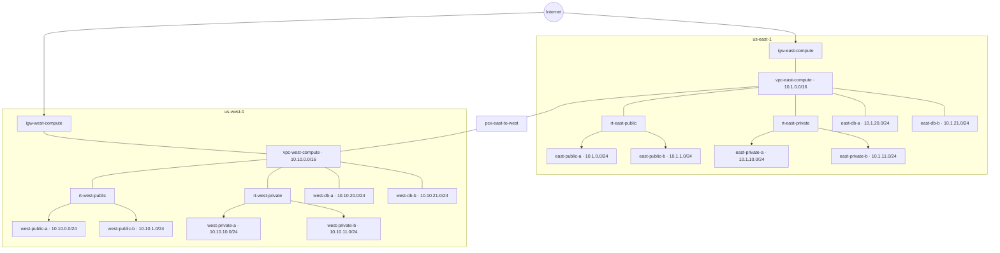

## AWS infra setup

> **NOTE:**
> - This document describes the bootstrap of a sample AWS infrastructure using Terraform.
> - Requires Terraform ≥1.10 and AWS provider ≥6.34.0.
> - AWS authentication relies on the `AWS_PROFILE` environment variable — ensure it is set before running any Terraform commands, e.g. `export AWS_PROFILE=<your-profile>`.

## Table of Contents

- [Provider](#provider)
- [Remote State](#remote-state)
- [New Module Bootstrap](#new-module-bootstrap)
- [01-bootstrap](#01-bootstrap)
- [02-networking](#02-networking)
  - [core-vpcs](#core-vpcs)
  - [core-subnets](#core-subnets)
  - [core-routing](#core-routing)
  - [core-security-groups](#core-security-groups)
  - [Network Resources Diagram](#network-resources-diagram)
- [03-iam](#03-iam)
  - [bastion](#bastion)

## Provider

All modules use the [AWS Terraform provider](https://registry.terraform.io/providers/hashicorp/aws/latest) (`hashicorp/aws`). The provider translates Terraform resource definitions into AWS API calls, managing the full lifecycle of AWS resources (create, read, update, delete).

- [Registry page](https://registry.terraform.io/providers/hashicorp/aws/latest)
- [Documentation](https://registry.terraform.io/providers/hashicorp/aws/latest/docs)
- [GitHub](https://github.com/hashicorp/terraform-provider-aws)

## Remote State

All modules store state in S3 bucket `terraform-state-607527010331`. It is created in `01-bootstrap` step, using local state.

| Module                      | State key                                                 |
|-----------------------------|-----------------------------------------------------------|
| 02-networking/core-vpcs     | `aws-infra/02-networking/core-vpcs/terraform.tfstate`     |
| 02-networking/core-subnets  | `aws-infra/02-networking/core-subnets/terraform.tfstate`  |
| 02-networking/core-routing          | `aws-infra/02-networking/core-routing/terraform.tfstate`          |
| 02-networking/core-security-groups  | `aws-infra/02-networking/core-security-groups/terraform.tfstate`  |
| 03-iam/bastion                      | `aws-infra/03-iam/bastion/terraform.tfstate`                      |
| 03-vault                            | `aws-infra/03-vault/terraform.tfstate`                            |

## New Module Bootstrap

Copy files from `module_skel/` into the new module directory and replace the `<module-path>` placeholders in `locals.tf` and `terraform.tf` with the module's relative path (e.g. `02-networking/core-vpcs`).

## 01-bootstrap

Native S3 state locking via `use_lockfile = true` — no DynamoDB table required.

**Resource types:** [aws_s3_bucket](https://registry.terraform.io/providers/hashicorp/aws/latest/docs/resources/s3_bucket), [aws_s3_bucket_versioning](https://registry.terraform.io/providers/hashicorp/aws/latest/docs/resources/s3_bucket_versioning), [aws_s3_bucket_server_side_encryption_configuration](https://registry.terraform.io/providers/hashicorp/aws/latest/docs/resources/s3_bucket_server_side_encryption_configuration), [aws_s3_bucket_public_access_block](https://registry.terraform.io/providers/hashicorp/aws/latest/docs/resources/s3_bucket_public_access_block)

**Resources:**
- `aws_s3_bucket` — state bucket
- `aws_s3_bucket_versioning` — versioning enabled
- `aws_s3_bucket_server_side_encryption_configuration` — AES256 encryption
- `aws_s3_bucket_public_access_block` — all public access blocked

**Outputs:**
- `state_bucket_name` — bucket name
- `state_bucket_arn` — bucket ARN

## 02-networking

Creates resources in east and west regions for core networking infrastructure.

### core-vpcs

**Resource types:** [aws_vpc](https://registry.terraform.io/providers/hashicorp/aws/latest/docs/resources/vpc)

**Resources:**
- `aws_vpc.east` — east VPC (`us-east-1`) with DNS support enabled
- `aws_vpc.west` — west VPC (`us-west-1`) with DNS support enabled

**Outputs:**
- `east_vpc_id`, `west_vpc_id` — VPC IDs
- `east_vpc_cidr`, `west_vpc_cidr` — VPC CIDR blocks

### core-subnets

VPC CIDRs are retrieved from `core-vpcs` remote state. Subnet CIDRs are derived dynamically from those using `cidrsubnet()` — see [docs](https://developer.hashicorp.com/terraform/language/functions/cidrsubnet). AZs are resolved at runtime using `aws_availability_zones` filtered by `zone-type = availability-zone` to exclude Local Zones and Wavelength Zones.

**Resource types:** [aws_subnet](https://registry.terraform.io/providers/hashicorp/aws/latest/docs/resources/subnet)

**Resources:**
- `aws_subnet.east_private_a`, `aws_subnet.east_private_b` — east private subnets
- `aws_subnet.east_public_a`, `aws_subnet.east_public_b` — east public subnets
- `aws_subnet.east_db_a`, `aws_subnet.east_db_b` — east database subnets
- `aws_subnet.west_private_a`, `aws_subnet.west_private_b` — west private subnets
- `aws_subnet.west_public_a`, `aws_subnet.west_public_b` — west public subnets
- `aws_subnet.west_db_a`, `aws_subnet.west_db_b` — west database subnets

**Outputs:**
- `east_private_subnets`, `east_public_subnets`, `east_db_subnets` — east subnet maps (id, cidr, az, vpc_id per subnet)
- `west_private_subnets`, `west_public_subnets`, `west_db_subnets` — west subnet maps (id, cidr, az, vpc_id per subnet)

### core-routing

VPC peering between east (`us-east-1`) and west (`us-west-1`) regions. Private subnets have local routing only (no NAT). DB subnets are fully isolated — local routing only, no IGW or peering routes.

Route tables are defined in `route_tables.tf`. Routes are added separately as `aws_route` resources in `igw.tf` and `vpc_peering.tf`.

**Resource types:** [aws_internet_gateway](https://registry.terraform.io/providers/hashicorp/aws/latest/docs/resources/internet_gateway), [aws_route_table](https://registry.terraform.io/providers/hashicorp/aws/latest/docs/resources/route_table), [aws_route_table_association](https://registry.terraform.io/providers/hashicorp/aws/latest/docs/resources/route_table_association), [aws_route](https://registry.terraform.io/providers/hashicorp/aws/latest/docs/resources/route), [aws_vpc_peering_connection](https://registry.terraform.io/providers/hashicorp/aws/latest/docs/resources/vpc_peering_connection), [aws_vpc_peering_connection_accepter](https://registry.terraform.io/providers/hashicorp/aws/latest/docs/resources/vpc_peering_connection_accepter)

| Route table | Routes |
|---|---|
| `rt-east-public` | `0.0.0.0/0 → igw-east`, `10.10.0.0/16 → pcx` |
| `rt-east-private` | `10.10.0.0/16 → pcx` |
| `rt-east-db` | local only |
| `rt-west-public` | `0.0.0.0/0 → igw-west`, `10.1.0.0/16 → pcx` |
| `rt-west-private` | `10.1.0.0/16 → pcx` |
| `rt-west-db` | local only |

**Resources:**
- `aws_internet_gateway.east`, `aws_internet_gateway.west` — internet gateways attached to each VPC
- `aws_route_table.east_public`, `aws_route_table.east_private`, `aws_route_table.east_db` — east route tables with subnet associations
- `aws_route_table.west_public`, `aws_route_table.west_private`, `aws_route_table.west_db` — west route tables with subnet associations
- `aws_vpc_peering_connection.east_to_west` — cross-region VPC peering connection

**Outputs:**
- `east_igw_id`, `west_igw_id` — internet gateway IDs
- `east_public_route_table_id`, `east_private_route_table_id`, `east_db_route_table_id` — east route table IDs
- `west_public_route_table_id`, `west_private_route_table_id`, `west_db_route_table_id` — west route table IDs
- `vpc_peering_connection_id` — VPC peering connection ID

### core-security-groups

VPC IDs are retrieved from `core-vpcs` remote state. SSH ingress is restricted to `bastion_allowed_cidr` — set this to your public IP in `terraform.tfvars`.

**Resource types:** [aws_security_group](https://registry.terraform.io/providers/hashicorp/aws/latest/docs/resources/security_group), [aws_vpc_security_group_ingress_rule](https://registry.terraform.io/providers/hashicorp/aws/latest/docs/resources/vpc_security_group_ingress_rule), [aws_vpc_security_group_egress_rule](https://registry.terraform.io/providers/hashicorp/aws/latest/docs/resources/vpc_security_group_egress_rule)

**Resources:**
- `aws_security_group.bastion_east`, `aws_security_group.bastion_west` — bastion host security groups
- `aws_vpc_security_group_ingress_rule.bastion_east_ssh`, `aws_vpc_security_group_ingress_rule.bastion_west_ssh` — SSH ingress from `bastion_allowed_cidr`
- `aws_vpc_security_group_egress_rule.bastion_east_all`, `aws_vpc_security_group_egress_rule.bastion_west_all` — all outbound traffic allowed

**Outputs:**
- `bastion_east_sg_id`, `bastion_west_sg_id` — bastion security group IDs

### Network Resources Diagram

Shows the combined resources of `core-vpcs`, `core-subnets`, and `core-routing`.

## 03-iam

IAM resources shared across modules. Each sub-module groups roles and instance profiles by workload.

### bastion

Instance profile for bastion EC2 instances. Grants SSM Session Manager access (connect without SSH) and CloudWatch Logs access (ship system logs). No S3, KMS, or other permissions.

**Resource types:** [aws_iam_role](https://registry.terraform.io/providers/hashicorp/aws/latest/docs/resources/iam_role), [aws_iam_role_policy_attachment](https://registry.terraform.io/providers/hashicorp/aws/latest/docs/resources/iam_role_policy_attachment), [aws_iam_instance_profile](https://registry.terraform.io/providers/hashicorp/aws/latest/docs/resources/iam_instance_profile)

**Resources:**
- `aws_iam_role.bastion` — EC2 trust policy
- `aws_iam_role_policy_attachment.bastion_ssm` — SSM Session Manager access
- `aws_iam_role_policy_attachment.bastion_cloudwatch` — CloudWatch Logs access
- `aws_iam_instance_profile.bastion` — instance profile attached to bastion EC2 instances

**Outputs:**
- `bastion_instance_profile_name` — instance profile name
- `bastion_instance_profile_arn` — instance profile ARN
